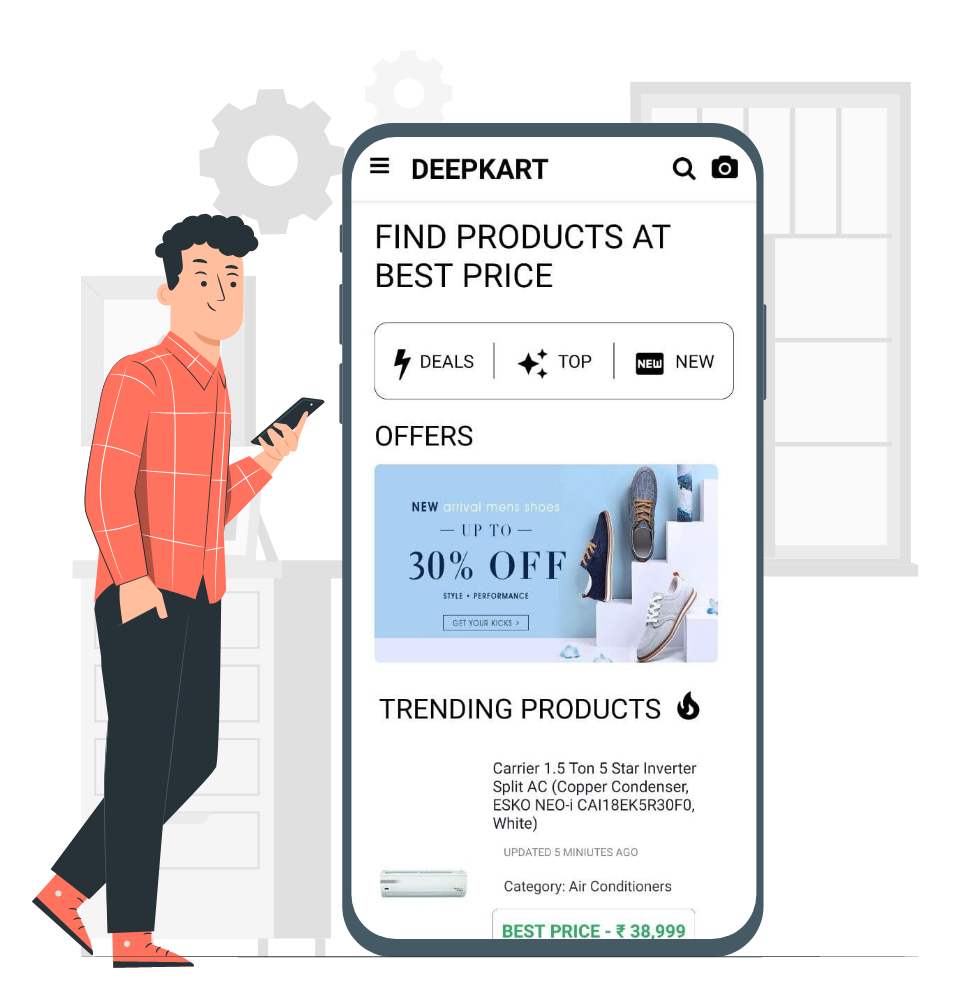
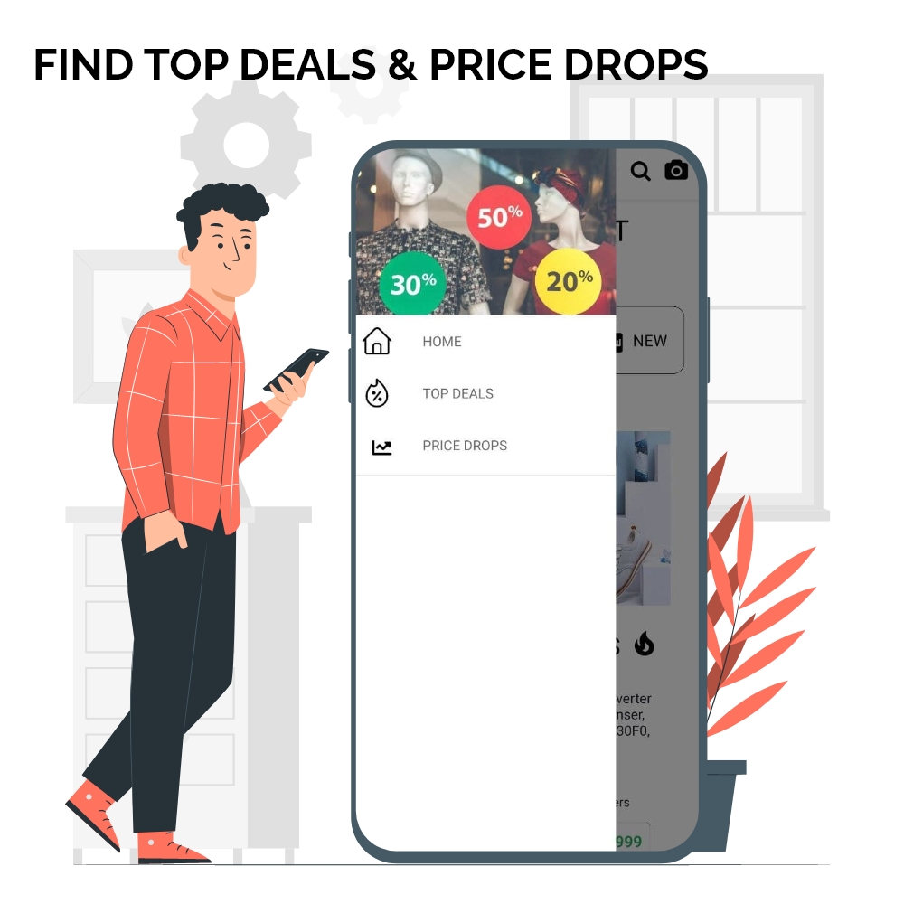
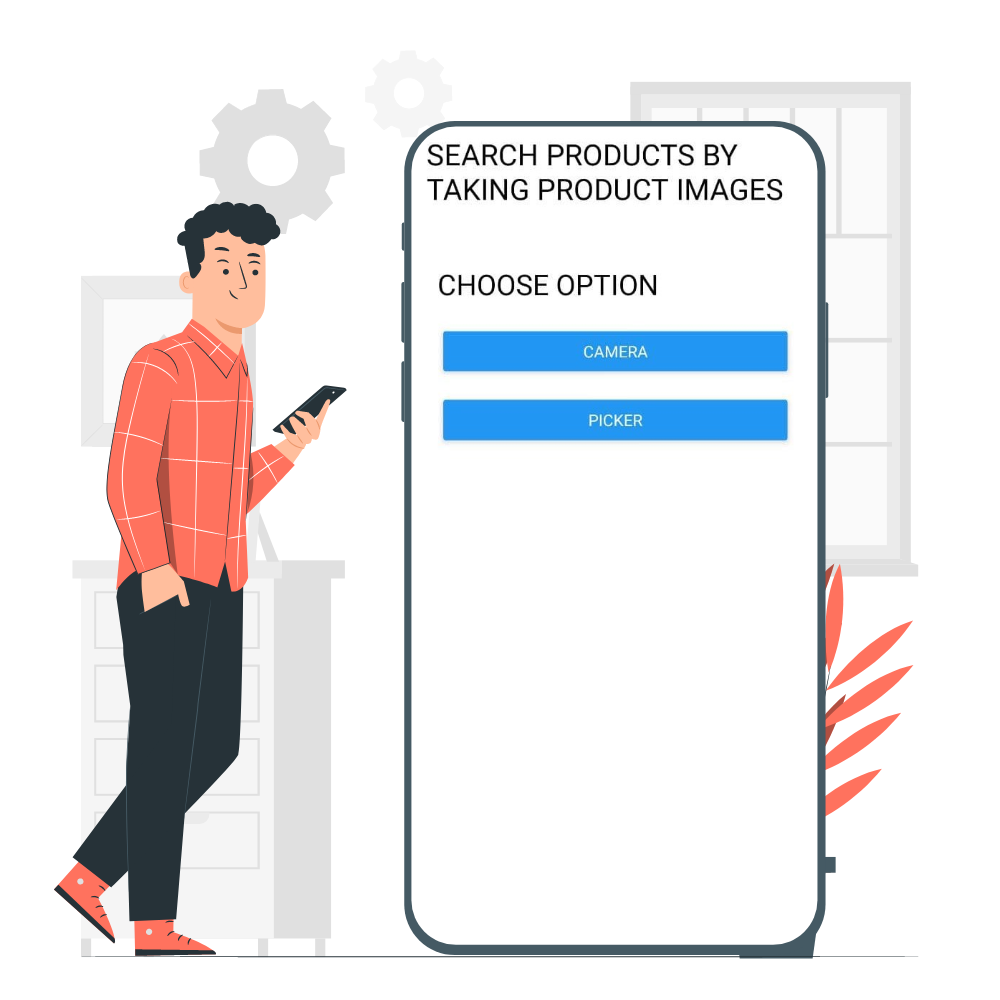
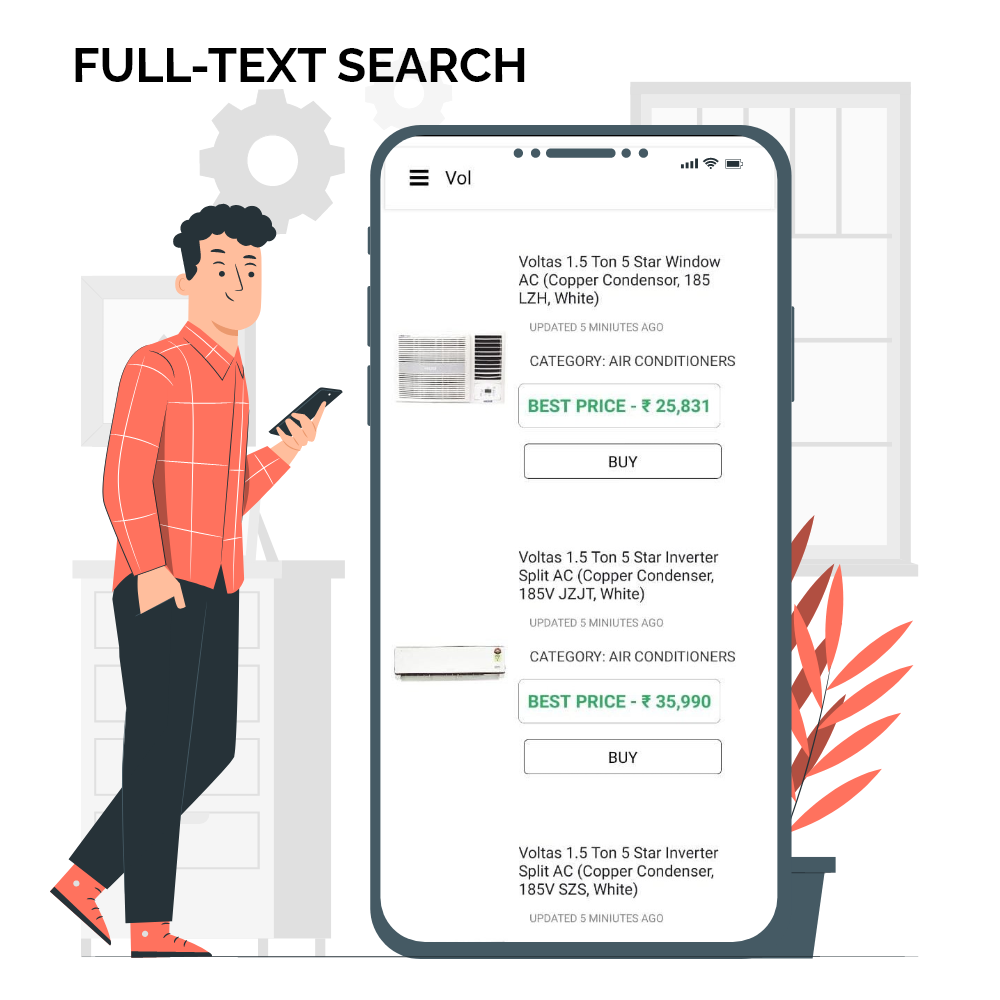

<!-- PROJECT LOGO -->
 

  

  <h3 align="center">Deepkart</h3>

  

    AI Powered Shopping Assistant
     
     
    <a href="https://github.com/othneildrew/Best-README-Template">View Demo</a>
    ·
    <a href="https://github.com/AmeyaUpalanchi/Deepkart/issues">Report Bug</a>
    ·
    <a href="https://github.com/AmeyaUpalanchi/Deepkart/issues">Request Feature</a>
  

<!-- TABLE OF CONTENTS -->

  
Table of Contents

  <ol>
    <li>
      <a href="#about-the-project">About The Project</a>
      <ul>
        <li><a href="#built-with">Built With</a></li>
      </ul>
    </li>
    <li><a href="#usage">Usage</a></li>
    <li><a href="#contact">Contact</a></li>
  </ol>

<!-- ABOUT THE PROJECT -->
## About The Project

  
  .
  
  .
  
  .
  
  .
  

Deepkart is a shopping assistant mobile app that shows users the best price and top deals of products from top ecommerce stores in India. User can also find products by scanning product text 

### Built With

* [React native](https://reactnative.dev/)
* [Algolia](https://www.algolia.com/)
* [Firebase](https://firebase.google.com/)
* [Tesseract.js](https://tesseract.projectnaptha.com/)
* [Scrapy](https://scrapy.org/)

<!-- USAGE EXAMPLES -->
## Usage

The app is in development stage

[Test the app] (https://appdistribution.firebase.dev/i/d041b08ed194db74)

<!-- CONTACT -->
## Contact

Ameya Upalanchi - ameya.upalanchi18@vit.edu
